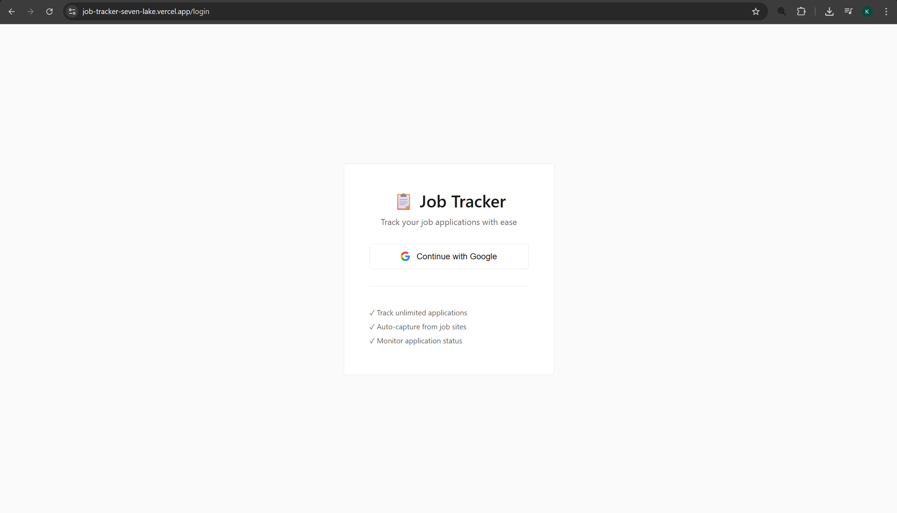
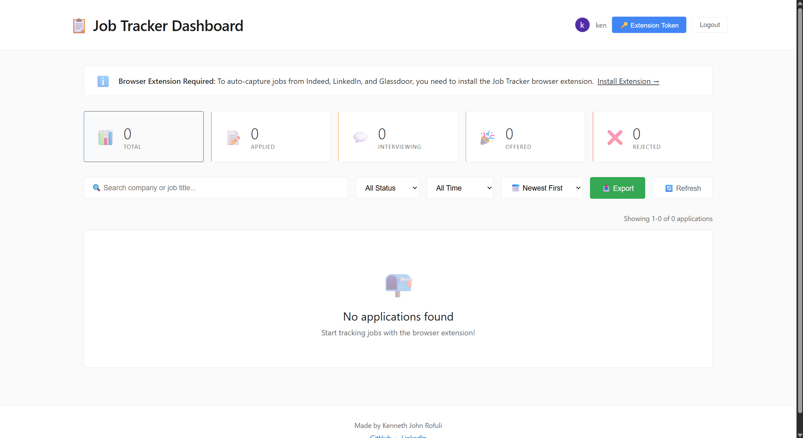
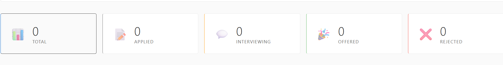
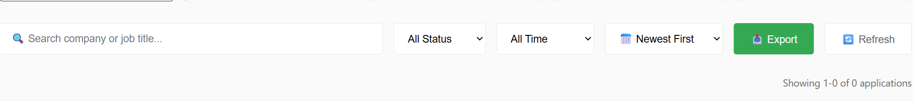

# Job Tracker

A comprehensive MERN stack application that automatically tracks your job applications using a browser extension. Say goodbye to manual spreadsheets and hello to automated job application tracking!

[](./LICENSE)
[](https://nodejs.org/)
[](https://reactjs.org/)
[](https://www.mongodb.com/cloud/atlas)

---

## Documentation

**Complete documentation is available in the [docs/](./docs) folder:**

- **[Documentation Home](./docs/README.md)** - Complete documentation index
- **[Quick Start Guide](./docs/guides/TESTING_QUICK_START.md)** - Get started in 5 minutes
- **[Mobile OAuth Guide](./docs/guides/MOBILE_OAUTH_GUIDE.md)** - Fix iOS authentication issues
- **[CI/CD Setup](./docs/deployment/CI_CD_GUIDE.md)** - Automated deployment with GitHub Actions
- **[Security Documentation](./docs/security/SECURITY.md)** - Security features and best practices

---

## Features

- **Automatic Capture**: Browser extension automatically captures job details when you apply
- **Interactive Dashboard**: Beautiful React dashboard to view and manage all applications
- **Smart Search & Filter**: Quickly find applications by company, title, or status
- **Real-time Stats**: Track your application metrics with clickable stat cards
- **Duplicate Prevention**: Intelligent system prevents duplicate entries
- **Quick Access**: Click company names to revisit job postings
- **Location Tracking**: Automatically captures job location information
- **Multi-Site Support**: Works on Indeed, LinkedIn, Glassdoor, and OnlineJobs.ph
- **Google OAuth**: Secure authentication with your Google account

## Tech Stack

### Backend
- **Node.js** & **Express.js** - RESTful API server
- **MongoDB Atlas** - Cloud database with indexed duplicate prevention
- **Mongoose** - ODM for MongoDB
- **Passport.js** - Google OAuth authentication
- **JWT** - Token-based authentication

### Frontend
- **React 18** - Modern UI framework
- **React Router** - Client-side routing
- **Axios** - HTTP client for API calls
- **CSS3** - Minimalist responsive styling

### Browser Extension
- **Chrome Extension Manifest V3** - Modern extension architecture
- **Content Scripts** - DOM scraping for job sites
- **Background Service Worker** - API communication

## Prerequisites

Before you begin, ensure you have:
- **Node.js** (v14 or higher) installed
- **MongoDB Atlas** account (free tier works great!)
- **Google Cloud Console** account (for OAuth)
- **Google Chrome** browser
- **Git** for version control

## Installation

### 1. Clone the Repository

```bash
git clone https://github.com/KennethRofuli/JobTracker.git
cd JobTracker
```

### 2. Setup Backend

```bash
cd backend
npm install
```

Create a `.env` file in the `backend` folder:

```env
MONGODB_URI=your_mongodb_atlas_connection_string
PORT=5000
CLIENT_URL=http://localhost:3000
GOOGLE_CLIENT_ID=your_google_client_id
GOOGLE_CLIENT_SECRET=your_google_client_secret
JWT_SECRET=your_jwt_secret
SESSION_SECRET=your_session_secret
```

**Getting your MongoDB URI:**
1. Go to [MongoDB Atlas](https://www.mongodb.com/cloud/atlas)
2. Create a free cluster
3. Click "Connect" → "Connect your application"
4. Copy the connection string
5. Replace `<password>` with your database password
6. Replace `myFirstDatabase` with your database name (e.g., `jobtracker`)

**Setting up Google OAuth:**
See [OAuth Setup Guide](./docs/security/OAUTH_SETUP.md) for detailed instructions.

**Generate secrets:**
```bash
node -e "console.log(require('crypto').randomBytes(32).toString('hex'))"
```

Start the backend server:

```bash
npm start
```

You should see:
```
Server running on port 5000
MongoDB Connected: [your-cluster-info]
```

### 3. Setup Frontend

Open a new terminal:

```bash
cd frontend
npm install
npm start
```

The dashboard will open automatically at `http://localhost:3000`

### 4. Install Browser Extension

1. Open **Google Chrome**
2. Go to `chrome://extensions/`
3. Enable **Developer mode** (toggle in top-right)
4. Click **Load unpacked**
5. Navigate to the `extension` folder in your project
6. Select the folder

You should see the **Job Tracker** extension installed!

## How to Use

### First Time Setup

1. Open `http://localhost:3000` in your browser
2. Click **Continue with Google**
3. Authorize the application with your Google account
4. You'll be redirected to your dashboard


*Secure Google OAuth login page*

### Extension Setup

1. Click the extension icon in Chrome
2. Click **Login with Google** (opens web app)
3. Or paste your auth token manually from the web app


*Browser extension popup for manual entry and authentication*

### Method 1: Manual Entry with Extension (Recommended)

This is the **most reliable method** for capturing job applications:

1. **Open** a job posting on any site (Indeed, LinkedIn, Glassdoor, OnlineJobs.ph, etc.)
2. **Click** the extension icon in your Chrome toolbar
3. The popup will **attempt to auto-fill** data from the current page
4. **Review and edit** the auto-filled fields:
   - Company Name (required)
   - Job Title (required)
   - Location
   - Job URL (auto-filled)
   - Source (Indeed, LinkedIn, etc.)
   - Status (Applied, Interview, Offer, Rejected)
5. **Click** "Save Application"
6. Success message appears!

**Why manual entry is recommended:**
- ✅ Works on **any job site**, not just supported ones
- ✅ You can **verify** the data before saving
- ✅ Takes only **5-10 seconds** per application
- ✅ No duplicates or missing data
- ✅ Add notes or custom status immediately

### Method 2: Automatic Capture (Experimental)

**⚠️ Note: Auto-capture is unreliable** due to frequent website changes. Use as a backup only.

1. **Navigate** to a supported job site (Indeed, LinkedIn, Glassdoor, OnlineJobs.ph)
2. **Open** a job posting
3. **Click** the "Apply" or "Easy Apply" button on the job posting
4. The extension *may* automatically capture and save the job details
5. Check dashboard to confirm it was saved correctly

**Known limitations:**
- ❌ Job sites frequently change their HTML structure, breaking auto-capture
- ❌ May capture incomplete or incorrect data
- ❌ Doesn't work on all job sites
- ❌ Timing issues can cause failures
- ⚠️ **Always verify** captured data in the dashboard

**If auto-capture fails:**
- Use the manual entry method (Method 1) instead
- The extension popup can still auto-fill most fields
- Takes only a few seconds to manually save

### Managing Applications


*Main dashboard showing your job applications with search, filters, and statistics*

#### Dashboard Features Overview

The dashboard provides a comprehensive view of all your job applications with powerful management tools.

#### Interactive Stats Cards (Clickable Filters)


*Click any stat card to filter applications by status*

Click any stat card to instantly filter your applications:
- **Total Applications** - Shows all applications (removes filters)
- **Applied** - Shows only "Applied" status
- **Interviewing** - Shows only "Interviewing" status  
- **Offers** - Shows only "Offered" status
- **Rejected** - Shows only "Rejected" status

*Tip: Click the same card again to clear the filter*

#### Search Functionality

**Search Bar** (🔍 icon):
- Search by **company name** (e.g., "Google", "Microsoft")
- Search by **job title** (e.g., "Software Engineer", "Developer")
- Real-time filtering as you type
- Case-insensitive search

#### Filtering Options


*Search bar and filtering controls for finding applications*

**Status Filter**:
- All Status (default)
- Applied
- Interviewing
- Offered
- Rejected
- Accepted

**Date Filter**:
- All Time (default)
- Last 7 Days
- Last 30 Days
- Last 90 Days

**Sort Options**:
- 📅 Newest First (default)
- 📅 Oldest First
- 🏢 Company A-Z
- 🏢 Company Z-A

#### Application Table Features

**Columns Displayed**:
- **Company** - Click to open job URL in new tab
- **Job Title** - Full position title
- **Location** - Job location (if available)
- **Date Applied** - When you applied
- **Source** - Where you found the job (LinkedIn, Indeed, etc.)
- **Status** - Current application status (editable dropdown)
- **Actions** - Delete button

**Interactive Features**:
- **Click company names** with 🔗 icon to revisit job postings
- **Update status** by selecting from dropdown (Applied → Interviewing → Offered, etc.)
- **Delete applications** with delete button (confirmation required)
- **Pagination** - 25 applications per page
- **Results counter** - Shows "Showing X-Y of Z applications"

#### Export Functionality

**CSV Export** (📥 Export button):
- Exports currently filtered applications
- Includes: Company, Job Title, Location, Status, Source, Date Applied, URL
- Opens as downloadable CSV file
- Perfect for backup or external analysis

#### Additional Dashboard Actions

**Refresh Button** (🔄):
- Manually refresh data from server
- Syncs latest changes from extension

**Extension Token** (🔑 button):
- Copy authentication token for extension
- Use if automatic login fails
- Token expires after 30 days

**Logout Button**:
- Sign out of your account
- Clears local authentication
- Notifies extension to log out

## Supported Job Sites

### Indeed
- Company name
- Job title  
- Location
- Auto-capture on Apply button

### LinkedIn
- Company name
- Job title
- Location
- Auto-capture on Easy Apply button

### Glassdoor
- Company name
- Job title
- Location
- Auto-capture on Apply button

### OnlineJobs.ph
- Job title
- Auto-capture on Apply button
- Company info may be limited (shows as "OnlineJobs.ph Employer")

## Best Practices

1. **Keep servers running**: Both backend (port 5000) and frontend (port 3000) must be running
2. **Active tabs work best**: Extension works better when tab is active (retry logic handles inactive tabs)
3. **Wait for page load**: Ensure job posting is fully loaded before clicking Apply
4. **Manual backup**: Use manual entry if auto-capture fails
5. **Regular backups**: Your data is in MongoDB Atlas cloud storage

## Troubleshooting

### "Can't connect to server" error
- Ensure backend is running on port 5000
- Check MongoDB connection in backend terminal
- Verify `.env` file exists with correct MongoDB URI

### Extension not capturing data
- Refresh the page and try again
- Check if you're on a supported site
- Use manual entry as backup
- Make sure job details are visible on page
- Verify you're logged in (check extension popup)

### Duplicate entries
- System prevents exact duplicates (same company + job title)
- Database indexes enforce uniqueness per user
- Case-insensitive matching

### Frontend not loading
- Check if port 3000 is available
- Verify backend is running first
- Clear browser cache and reload

### Authentication issues
- Token expires after 30 days
- Log in again to get a new token
- Make sure Google OAuth is properly configured

## Project Structure

```
JobTracker/
├── backend/
│   ├── src/
│   │   ├── config/
│   │   │   ├── db.js              # MongoDB connection
│   │   │   └── passport.js        # OAuth configuration
│   │   ├── controllers/
│   │   │   └── applicationController.js  # CRUD logic
│   │   ├── middleware/
│   │   │   └── auth.js            # JWT authentication
│   │   ├── models/
│   │   │   ├── Application.js     # Application schema
│   │   │   └── User.js            # User schema
│   │   └── routes/
│   │       ├── applications.js    # API routes
│   │       └── auth.js            # Auth routes
│   ├── .env                       # Environment variables
│   ├── server.js                  # Express server
│   └── package.json
│
├── frontend/
│   ├── src/
│   │   ├── components/
│   │   │   ├── Stats.js           # Stats cards
│   │   │   ├── ApplicationTable.js # Application table
│   │   │   ├── Login.js           # Login page
│   │   │   └── AuthSuccess.js     # OAuth callback
│   │   ├── App.js                 # Main component
│   │   ├── App.css                # Styling
│   │   └── index.js               # Entry point with routing
│   └── package.json
│
└── extension/
    ├── manifest.json              # Extension config
    ├── popup.html                 # Extension UI
    ├── popup.js                   # Popup logic
    ├── content.js                 # Page scraping
    ├── background.js              # API communication
    ├── styles.css                 # Extension styles
    └── icons/                     # Extension icons
```

## API Endpoints

```
GET    /api/applications          # Get all applications (authenticated)
POST   /api/applications          # Create new application (authenticated)
PUT    /api/applications/:id      # Update application (authenticated)
DELETE /api/applications/:id      # Delete application (authenticated)

GET    /api/auth/google           # Initiate Google OAuth
GET    /api/auth/google/callback  # OAuth callback
GET    /api/auth/me               # Get current user
POST   /api/auth/logout           # Logout
```

## Customization

### Adding New Job Sites

Edit `extension/content.js` and add selectors:

```javascript
function extractJobInfo() {
  // Add your site detection
  if (window.location.hostname.includes('yourjobsite.com')) {
    return {
      company: document.querySelector('.company-selector')?.textContent?.trim(),
      title: document.querySelector('.title-selector')?.textContent?.trim(),
      location: document.querySelector('.location-selector')?.textContent?.trim()
    };
  }
  // ... existing code
}
```

Update `manifest.json` to include the new site:

```json
"content_scripts": [{
  "matches": [
    "*://*.yourjobsite.com/*"
  ]
}]
```

## Security

This application implements industry-standard security practices:

- **OAuth 2.0** with CSRF protection
- **JWT tokens** with secure storage (cookies + localStorage for mobile)
- **Rate limiting** to prevent abuse
- **Input validation** and sanitization
- **NoSQL injection** prevention
- **Security headers** with Helmet.js
- **HTTPS** enforced in production
- **Mobile-friendly** authentication (iOS Safari compatible)

### Security Documentation

- **[Security Overview](./docs/security/SECURITY.md)** - Complete security features and implementation
- **[OAuth Setup Guide](./docs/security/OAUTH_SETUP.md)** - Google OAuth 2.0 configuration
- **[OAuth Flow Diagram](./docs/security/OAUTH_FLOW_DIAGRAM.md)** - Visual authentication flow
- **[OAuth Security Details](./docs/security/OAUTH_SECURITY_IMPLEMENTATION.md)** - Detailed security measures
- **[GCP Security Checklist](./docs/security/GCP_SECURITY_CHECKLIST.md)** - Production security checklist

### Mobile OAuth Issues?

If you're experiencing authentication issues on iOS/mobile devices, see the [Mobile OAuth Guide](./docs/guides/MOBILE_OAUTH_GUIDE.md) for troubleshooting steps.

---

## Deployment

### Production Deployment Guides

- **[CI/CD with GitHub Actions](./docs/deployment/CI_CD_GUIDE.md)** - Automated testing and deployment
- **[Google Cloud Platform](./docs/deployment/GCP_CONSOLE_WALKTHROUGH.md)** - Deploy to GCP step-by-step

### Quick Deploy Options

**Frontend (Vercel):**
```bash
cd frontend
vercel
```

**Backend (Render/Railway/Fly.io):**
- Connect your GitHub repository
- Set environment variables
- Deploy automatically on push

---

## Contributing

Contributions are welcome! Here's how you can help:

1. **Fork** the repository
2. **Create** a feature branch (`git checkout -b feature/AmazingFeature`)
3. **Commit** your changes (`git commit -m 'Add some AmazingFeature'`)
4. **Push** to the branch (`git push origin feature/AmazingFeature`)
5. **Open** a Pull Request

### Areas for Contribution
- Bug fixes
- New features
- Documentation improvements
- UI/UX enhancements
- Security improvements

---

## License

This project is licensed under the MIT License - see the [LICENSE](./LICENSE) file for details.

---

## Author

**Kenneth John Rofuli**

- GitHub: [@KennethRofuli](https://github.com/KennethRofuli)
- LinkedIn: [Kenneth John Rofuli](https://www.linkedin.com/in/kenneth-john-r-2674522a6)

---

## Acknowledgments

- Built with the **MERN** stack
- **MongoDB Atlas** for cloud database
- **Passport.js** for OAuth authentication
- **Chrome Extensions API** for browser integration
- Inspired by the need for better job application tracking

---

## Support

- **Documentation**: [docs/README.md](./docs/README.md)
- **Bug Reports**: [GitHub Issues](https://github.com/KennethRofuli/JobTracker/issues)
- **Feature Requests**: [GitHub Discussions](https://github.com/KennethRofuli/JobTracker/discussions)

---

<div align="center">

**Star this repo if you find it helpful!**

*Track every application and land your dream job!*

</div>
